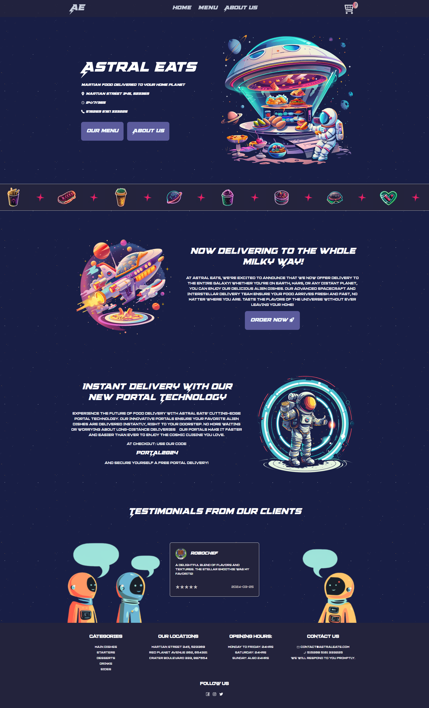

# Astral Eats

An alien food delivery website built using JavaScript and React. This project allows users to order "alien" food to their home planets, offering a user-friendly experience and visually appealing design. It features responsive layouts, intuitive navigation, and images created with Midjourney AI. The application utilizes Bootstrap for styling and is designed with a focus on modern web development practices.

## Key Features
- User-friendly interface for ordering alien food.
- Responsive design.
- Dynamic content rendering using React.
- AI-generated images for a unique visual experience.

## Technologies Used
- JavaScript
- React
- Bootstrap
- Midjourney AI

## Live Demo
[Astral Eats](https://astraleats.vercel.app/)

